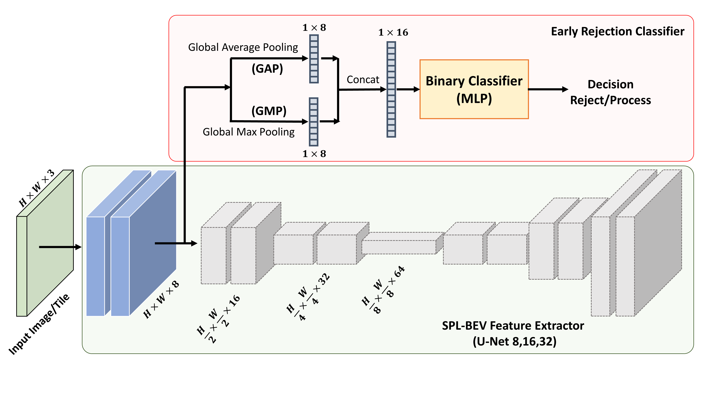
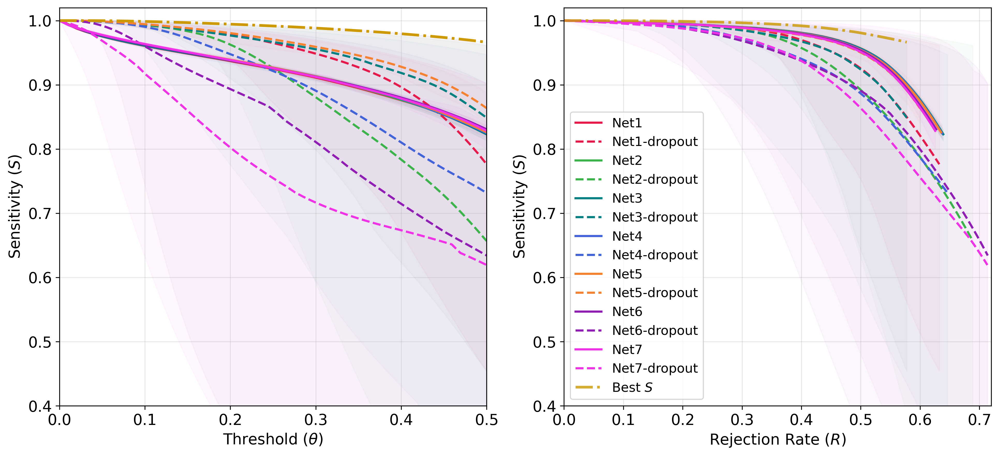

# EAST-SPL: Event-Aware Statistical Tiling for Decomposable Soccer Player Localization with an auxiliary rejection network
**[Abolfazl Chaman Motlagh](https://github.com/AbolfazlChM95)**, **[Mikael Nilsson](https://portal.research.lu.se/sv/persons/mikael-nilsson-2/)**

Official Repository of "EAST-SPL: Event-Aware Statistical Tiling for Decomposable Soccer Player Localization with an auxiliary rejection network". Accepted to International Conference on Pattern Recognition (ICPR) 2026. Lyon, France

> [!WARNING]
> **Work in progress:** This repository is actively being prepared for the official release.  

> [!TIP]
> This repository contains four subprojects. See the `README.md` inside each subproject folder for setup, usage, and implementation details.

## Overview

EAST-SPL replaces static single-frame tiling with an event-aware objective that minimizes **Expected Total FLOPs**. It uses player-location statistics to allocate finer tiles where players are more likely to appear, an **auxiliary rejection network** to skip empty tiles, and a **genetic algorithm** to optimize the tiling configuration.

[](assets/TripleFigure.png)
**Figure 1** (Left) Aggregated statistics of players locations on the pitch. (Right) Projected statistics and calculated probabilities for specific camera setting and tile configuration.

## The SPL-BEV with tile agnostic rejection head

The rejection head is attached to a shared Conv-block of Unet from feature extractor block in SPL-BEV. This will additionally save some FLOPs. In addition make the isolated training of MLP head for rejection network easier, since precalculated feature maps could be saved into vectors once and used as inputs for training.

[](assets/Architecture.png)
**Figure 2** The architecture of SPL-BEV feature extractor with rejection head.

## Dataset transformation
The dataset used for extracting the statistics is [Spiideo SoccerNet SynLoc](https://github.com/Spiideo/sskit) dataset. This repository does not redistribute the dataset. To extract the players locations, you should download and run the
```bash
python dataset_transformation/extract_locations.py /path/to/SpiideoSynLoc
```

## Optimal Tiles Config. search

| Search      | Objective | Pop. Size | Runtime (s) | ETF (GFLOPs) | TF (GFLOPs) | TF + M (GFLOPs) |
|-------------|-----------|-----------|-------------|--------------|-------------|------------------|
| Grid Search | ETF       | —         | 96.7        | 38.8         | —           | 308.2            |
| Grid Search | TF + M    | —         | 90.2        | 101.5        | —           | 163.4            |
| Genetic Algorithm | TF + M    | 50        | **2.3**     | 47.9         | 195.4       | 162.9            |
| Genetic Algorithm | TF + M    | 100       | 62.5        | 55.7         | 200.0       | **156.0**        |
| Genetic Algorithm | TF + M    | 100       | 54.2        | 43.9         | 217.2       | 158.2            |
| Genetic Algorithm | ETF       | 50        | 52.0        | **24.1**     | 232.5       | 165.8            |

**Table 1 in the paper.** Comparison of search methods and objectives. The Genetic Algorithm achieves lower runtime and better TF + M values than the Grid Search used in [DTSPL-BEV](https://doi.org/10.5220/0014468500004067), while optimizing the new ETF objective substantially reduces expected computational cost. `TF` denotes Total FLOPs, `ETF` denotes Expected Total FLOPs, and `TF + M` denotes Total FLOPs after merging.

## Isolated training of Rejection head 

The performance of an MLP attached to the main feature extractor in the DTSPL-BEV architecture as shown in the **Fig. 2** the has been studied independently as the training of the primary localization network!

[](assets/Architectural-Search-Performances.png)
**Figure 3** (Left) the sensitivity (Recall) of trained rejection head on generated dataset from SynLoc dataset vs classification threshold ($\theta$). (Right) Sensitivity vs Rejection rate over entire generated dataset.

## Citation
If you use this repository, please cite the main paper:
```bibtex
@inproceedings{chamanmotlagh2026eastspl,
  author    = {Chaman Motlagh, Abolfazl and Nilsson, Mikael},
  title     = {{EAST-SPL}: Event-Aware Statistical Tiling for Decomposable Soccer Player Localization with an auxiliary rejection network},
  booktitle = {Proceedings of the International Conference on Pattern Recognition},
  year      = {2026},
  note      = {Accepted}
}
```

Companion Workshop paper on Reproducibility of EAST-SPL
```bibtex
@misc{chamanmotlagh2026reproducibility,
  author = {Chaman Motlagh, Abolfazl and Nilsson, Mikael},
  title  = {On the Reproducibility of the {EAST-SPL} Pipeline: Event-Aware Statistical Tiling for Soccer Player Localization},
  year   = {2026},
  note   = {Submitted to the Sixth Workshop on Reproducible Research in Pattern Recognition}
}
```

### Related Works
This work extends our previous work [DTSP-BEV: Decomposable Tiled Soccer Player Localization↗](https://doi.org/10.5220/0014468500004067), presented at ICPRAM 2026.

Older work from our group, *"SPL-BEV: Soccer Player Localization and Birds-Eye-View Estimation"*: [[paper]](https://doi.org/10.1007/978-3-032-04968-1_10) | [[Code]](https://github.com/IvarPersson/SPL-BEV). 

### Dataset
Dataset used in this work is [Spiodeo SoccerNet SynLoc](https://github.com/Spiideo/sskit).
To cite the dataset use:
```bibtex
@inproceedings{ardo2025,
  author={Håkan Ardö and Mikael Nilsson and Anthony Cioppa and Floriane Magera and Silvio Giancola and Haochen Liu and Bernard Ghanem and Marc Van Droogenbroeck},
  booktitle={In Proceedings of the 20th International Joint Conference on Computer Vision, Imaging and Computer Graphics Theory and Applications - Volume 2: VISAPP},
  title={Spiideo SoccerNet SynLoc - Single Frame World Coordinate Athlete Detection and Localization with Synthetic Data},
  year={2025},
  pages={278-285},
  publisher={SciTePress},
  organization={INSTICC},
  issn={2184-4321},
  doi={10.5220/0013108200003912},
  isbn={978-989-758-728-3},
}
```

## License
EAST-SPL code is released under the MIT License. See [LICENSE](LICENSE) for additional details.
