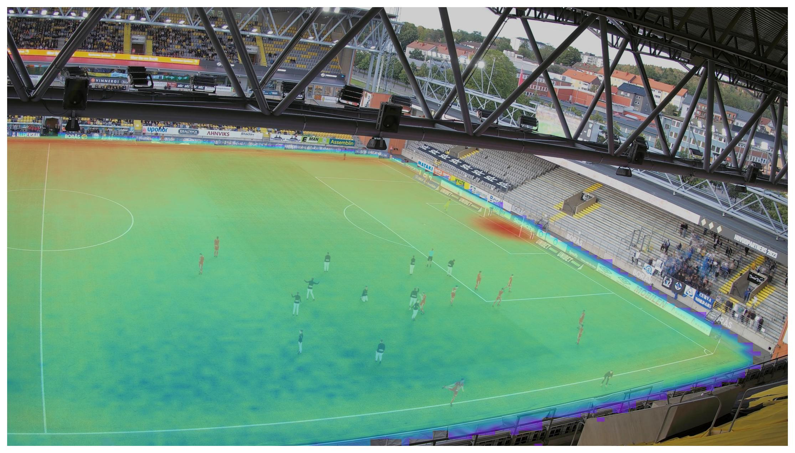

# Dataset Transformation

This folder contains scripts for aggregating player positions on the pitch, normalizing them across camera configurations, and projecting the resulting statistics onto a selected sample image.

## Requirements
The scripts require:

- Python 3
- NumPy
- pandas
- Pillow
- tqdm
- matplotlib
- [sskit](https://github.com/Spiideo/sskit)

The [Spiideo SoccerNet SynLoc](https://github.com/Spiideo/sskit) dataset must be downloaded separately and is not included in this repository.


The [project_to_image.py](project_to_image.py) script gets a sample image, and calculate the projected statistics. For the projection, we use [sskit](https://github.com/Spiideo/sskit) toolbox.

### `extract_locations.py`

The [`extract_locations.py`](extract_locations.py) script reads the dataset annotations from the `train`, `val`, and `test` splits and aggregates the available player positions.

It saves:

- `player_positions.pkl`: player coordinates, image identifiers, camera identifiers, and camera matrices.

Run it with:

```bash
python3 extract_locations.py \
  /path/to/spiideo_dataset \
  --output-dir .
```

### `project_to_image.py`

The [`project_to_image.py`](project_to_image.py) script uses the aggregated player positions and a selected sample image to:

- identify the corresponding camera parameters;
- normalize player positions to the selected pitch dimensions;
- project the positions onto the image plane;
- generate a projected probability heatmap.

It saves the generated files in the same directory as the sample image:

- `Cam_var.npz`
- `points2D.npy`
- `ProjHeatmap.npy`
- a projected heatmap visualization when `--plot` is enabled

Run it with:

```bash
python3 project_to_image.py \
  /path/to/spiideo_dataset \
  player_positions.pkl \
  sample_image/023626.jpg \
  --image-split train \
  --plot
```

## Example output plot

[](sample_field_2/ProjectedHeatmap.jpg)